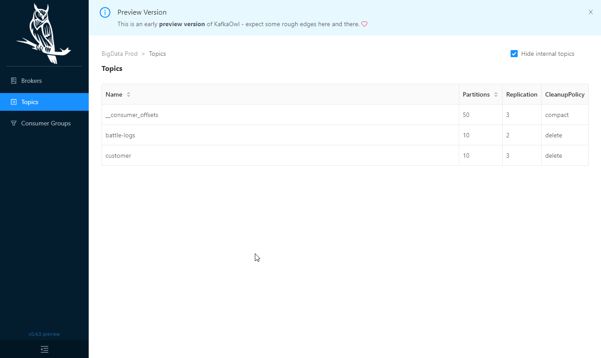
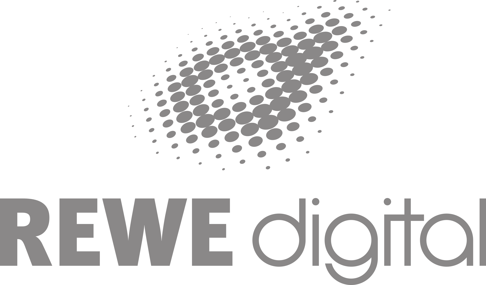

# Kowl

   

Kowl (previously known as Kafka Owl) is a web application that helps you to explore messages in your Apache Kafka cluster and get better insights on what is actually happening in your Kafka cluster in the most comfortable way:

## Features

- **Message viewer:** Explore your topics' messages in our message viewer through ad-hoc queries and dynamic filters. Find any message you want using JavaScript functions to filter messages.
- **Consumer groups:** List all your active consumer groups along with their active group offsets. You can view a visualization of group lags either by topic (sum of all partition lags), single partitions or the sum of all partition lags (group lag)
- **Topic overview:** Browse through the list of your Kafka topics, check their configuration, space usage, list all consumers who consume a single topic or watch partition details (such as low and high water marks, message count, ...).
- **Cluster overview:**: List available brokers, their space usage, rack id and other information to get a high level overview of your brokers in your cluster.

**A roadmap** is maintained using [milestones](https://github.com/cloudhut/kowl/milestones).

|  | Kowl | Kowl Business |
| :-- | :-: | :-: |
| **Topic Overview** | :white_check_mark: | :white_check_mark: |
| **Consumer Group Overview** | :white_check_mark: | :white_check_mark: |
| **Broker/Cluster Overview** | :white_check_mark: | :white_check_mark: |
| **Message viewer** | :white_check_mark: | :white_check_mark: |
| **Login System (Google, GitHub OAuth)** | :x: | :white_check_mark: |
| **RBAC permissions with group syncing** | :x: | :white_check_mark: |
| **Screenshots** | Preview .gif in README | https://cloudhut.dev/ |
| **Price** | Always free / Open source | Free during beta\* |

\*If you want to participate in the free beta sign in here: https://license.cloudhut.dev/ . You'll get a forever free license for 2 seats. If you need more than 2 seats, just drop us an email at info@cloudhut.dev

## Documentation

The documentation for Kowl & Kowl Business is available in this repository's [Wiki](https://github.com/cloudhut/kowl/wiki).

## Sponsors

## License

Kowl is distributed under the [Apache 2.0 License](https://github.com/cloudhut/kowl/blob/master/LICENSE).
