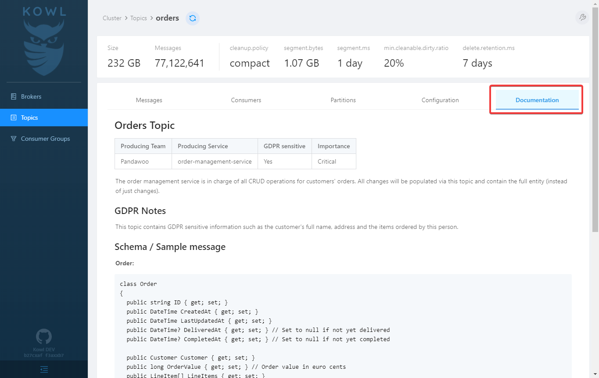

# Topic Documentation

If you wish to embed your topic's documentation into the Kowl user interface you can do this by providing access to a git repository which hosts your documentations in Markdown format. In practice this could look like this:



## How does it work

Kowl clones the provided git repository, recursively iterates through all directories in the repository (up to a max depth of 5) and stores all `.md` files it finds in memory.
The "Documentation" tab in the frontend will show the markdown of the file matching the name of the Kafka topic.

| Path/Filename        | Kafka Topic Name | Matches            |
| -------------------- | ---------------- | ------------------ |
| ordersv2.md          | orders-v2        | :x:                |
| Orders-v2.md         | orders-v2        | :x:                |
| orders-v2.md         | orders-v2        | :white_check_mark: |
| /orders/orders-v2.md | orders-v2        | :white_check_mark: |

## Config

Beside the repository url and branch you usually need to configure authentication credentials so that you can access private repositories. We support SSH as well as basic auth. If neither is specified you could still pull publicly accessible repositories.

Configuration is described below:

```yaml
owl:
  topicDocumentation:
    enabled: true
    # Git is where the topic documentation can come from, in the future there might be additional
    git:
      enabled: true
      repository:
        url: https://github.com/cloudhut/topic-docs
        branch: master
      # How often Kowl shall pull the repository to look for new files. Set 0 to disable periodic pulls
      refreshInterval: 1m
      # Basic Auth
      # If you want to use GitHub's personal access tokens use `token` as username and pass the token as password
      basicAuth:
        enabled: true
        username: token
        password: #  This can be set via the via the --owl.topic-documentation.git.basic-auth.password flag as well
      # SSH Auth
      # You can either pass the private key file directly via flag or yaml config or refer to a mounted key file
      ssh:
        enabled: false
        username:
        privateKey: # This can be set via the via the --owl.topic-documentation.git.ssh.private-key flag as well
        privateKeyFilepath:
        passphrase: # This can be set via the via the --owl.topic-documentation.git.ssh.passphrase flag as well
```
