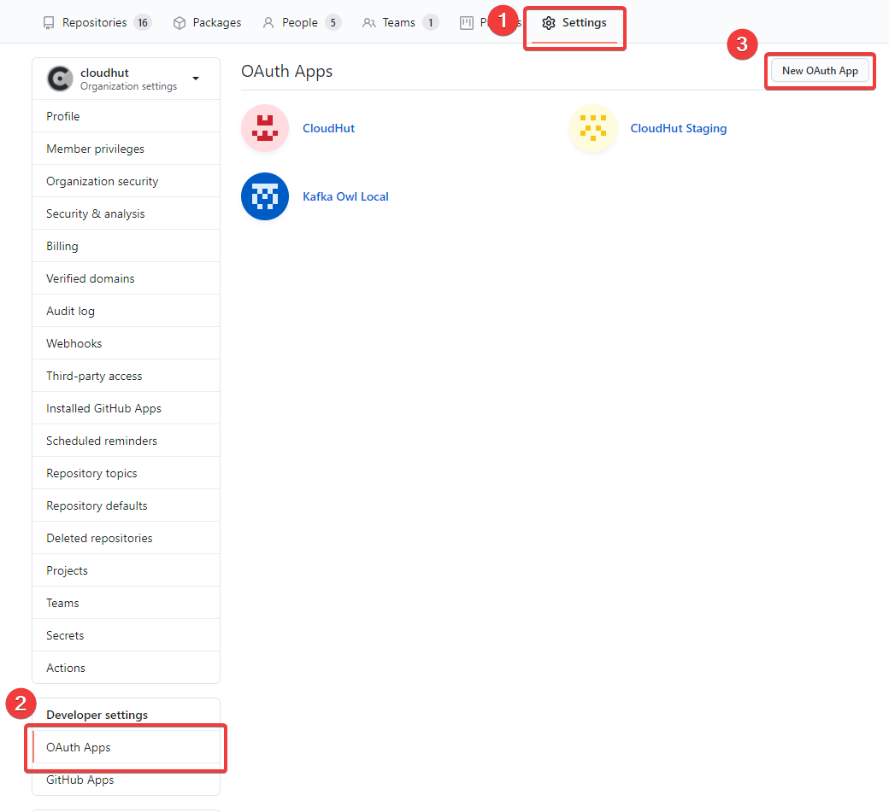
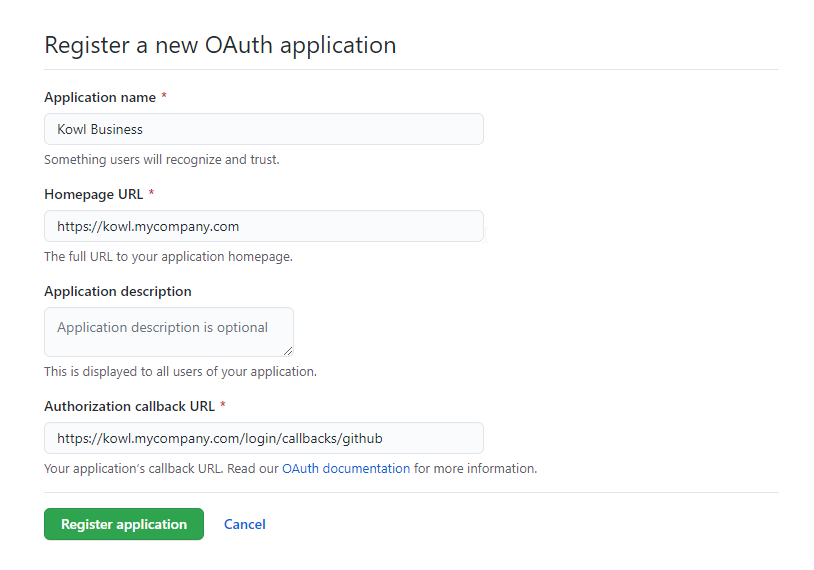
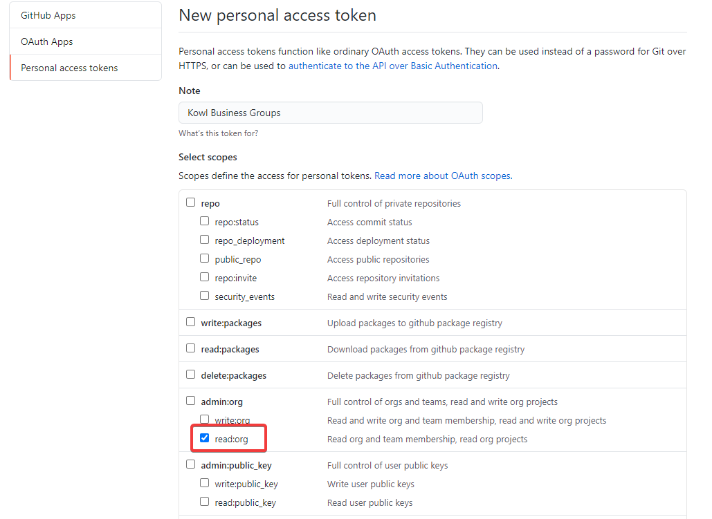
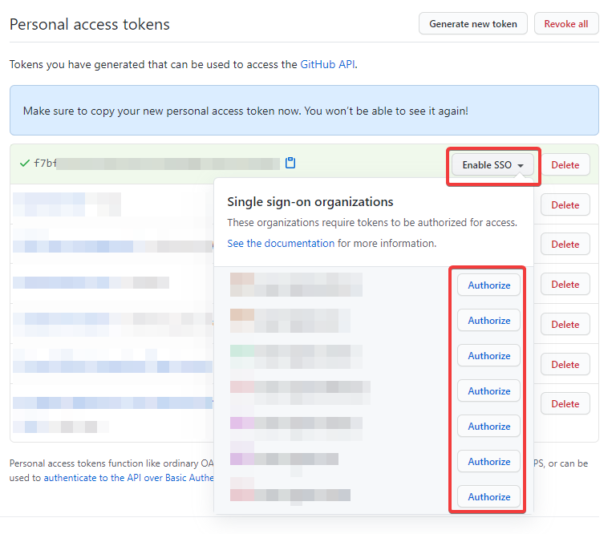

# GitHub OAuth Provider Setup

This section guides you through the required steps to setup an OAuth application at GitHub.
At the end of this guide you'll have an OAuth client id and client secret. If you are going
to setup the GitHub Groups Sync (step 2) you'll additionally end up with a personal access token. This
token is used by Kowl to resolve group memberships.

While most supported identity provider support OpenID connect GitHub is an exception as the GitHub API
only supports OAuth 2.0. Thus GitHub is handled a a bit differntly than other identity providers.

Teams within GitHub organizations are used as groups in Kowl.

## 1. Create a new OAuth application

You can create new OAuth applications for your personal account or as part of an organization. Technically
it doesn't matter what option you choose. In this tutorial we will create the OAuth application as part of
our CloudHut organization.

Head to your organization in GitHub (e.g. https://github.com/cloudhut), click the Settings Tab and in the
left menu (lower area of the page) click "Developer settings -> OAuth Apps". Then click the button
"New OAuth App".

You are asked to fill in some information to register your new OAuth application. Provide the following information:

- Application Name: Any name you prefer to describe the OAuth app. For instance "Kowl Business"
- Homepage URL: The URL to your Kowl Business deployment
- Authorization callback URL: To this URL users will be redirected after authenticating

Afterwards you'll be redirected to the OAuth app you just registered. There you'll find the client ID and client secret
which are needed for the Kowl Business configuration.

## 2. GitHub Groups Sync (optional)

If desired you can bind permissions (Roles) to GitHub Teams within an organization (see [Role Bindings](../authorization/role-bindings.md)). Therefore you must grant Kowl permissions to resolve the memberships of GitHub teams which you use in your RoleBindings.

For GitHub we utilize personal access tokens to do that. A personal access token allows us to impersonate a user and perform
actions on behalf of this user. The user who grants the permissions can define the scope of the permissions but it isn't possible
to reduce the scope to specific organizations for example. It is common to utilize [machine users](https://docs.github.com/en/developers/overview/managing-deploy-keys#machine-users) if you want to break down the permissions for specific organizations only.

GitHub reference docs: https://docs.github.com/en/github/authenticating-to-github/creating-a-personal-access-token

To create a personal access token you can browse to your personal account's developer settings or directly head to [https://github.com/settings/tokens](https://github.com/settings/tokens). Click the generate new token button and choose the `read:org` scope:

After creating the personal access token the secret token will be shown once. If you are using GitHub enterprise and have SSO enabled you
also need to enable SSO for this token in your desired organizations:

