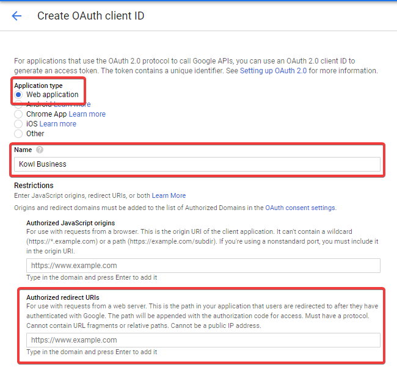
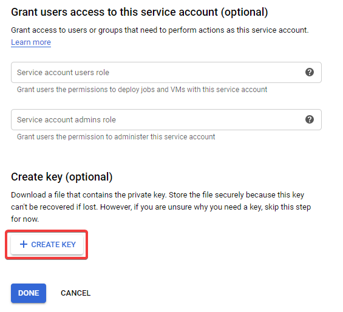
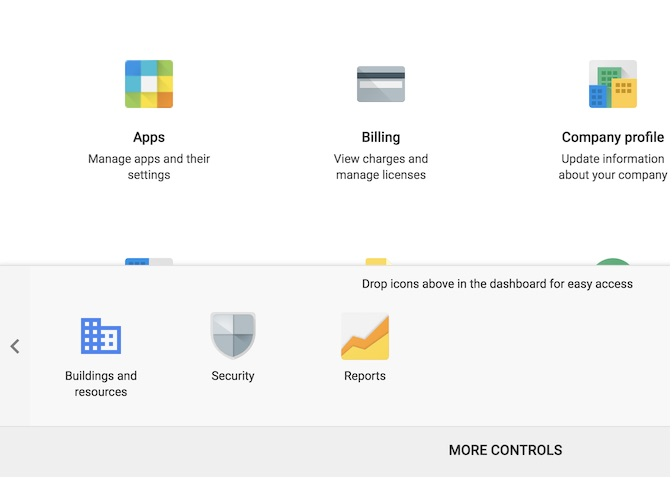

# Google OAuth / OIDC Provider Setup

This section guides you through the required steps to setup an OAuth application at Google.
At the end of this guide you'll have an OAuth client id and client secret. If you are going
to setup the Google Groups Sync (step 4) you'll additionally end up with a JSON file. This
JSON file is used by Kowl to impersonate a Google service account.

## 1. Create a Google Cloud project

If you do not already have a Google Cloud project you must create one first. Open Google Cloud's [Resource Manager](https://console.developers.google.com/cloud-resource-manager) and log into your account. Click "Create Project" and fill in the requested details.

You'll have a notification in the top right bar once your project has successfully been setup. This process may take a short while.

## 2. Setup OAuth consent screen

When your Google Project is ready to be used go ahead and [setup an OAuth consent screen](https://console.cloud.google.com/apis/credentials/consent). Before proceeding with the setup make sure your desired project is chosen in the toolbar at the top. When it asks you for the User Type choose `External` unless you know Kowl will only be used by users within your organization.

Fill in the required fields. Below fields may give you an idea what to fill in:

- **Application Name:** Kowl Business
- **Application Logo:** Your company's or Kowl's logo
- **Scopes:** No additional scope is required
- **Authorized domains:** Add all top level domains under which Kowl will be accessible (e.g. `mycompany.com`)
- **Application Homepage link:** Link to Kowl Domain (e.g. `https://kowl.prod.mycompany.com`)
- **Application Privacy Policy link:** URL to your privacy policy

Save the consent screen afterwards.

## 3. Generate OAuth credentials

Click [here](https://console.cloud.google.com/apis/credentials/consent) to create OAuth credentials. Choose application type `Web application`.

You could use `Kowl Business` as Name for your OAuth client and you need to add a valid redirect URI. The realtive path to the callback handler for Google is `/login/callbacks/google`. If you host Kowl under `https://kowl.prod.mycompany.com` you need to authorize `https://kowl.prod.mycompany.com/login/callbacks/google` as redirect URI.

Once you've entered all details, proceed by clicking "Create". A dialog box will open which shows you the **Client ID** along with it's **Client Secret**. Copy both values to a safe and secure location before clicking the "OK" button to proceed. We'll need these credentials in the Kowl config.

## 4. Google Groups Sync (optional)

If desired you can bind permissions (Roles) to Google Groups defined in your organization (see [Role Bindings](../authorization/role-bindings.md)). Therefore you must grant Kowl permissions to resolve the memberships of all bound Google Groups.

GCP Referece docs: https://developers.google.com/admin-sdk/directory/v1/guides/delegation

> :triangular_flag_on_post: Private Google Groups which are managed by different organizations can not be resolved.

#### Create a service account

At first we need to create a new Google Service account by either browsing to IAM & Admin -> Service Accounts or by directly clicking [here](https://console.cloud.google.com/iam-admin/serviceaccounts). Again, make sure you are working in the right Google Project by verifying the selected project name in the top bar. Click `Create Service Account` to proceed and fill in the fields like this:

After clicking `Create` you can add service account permissions. This service account does not need any further project roles, hence just click the `Continue` button. At the 3rd step we want to furnish a new Key for this service account. Do so by clicking the `Create Key` button and choose JSON afterwards. This will download a JSON file to your computer, we'll need it when deploying Kowl.

#### Grant domain wide delegation to service account

Now we need to grant the domain-wide delegation permission. You can do that by finding the created service account in the IAM & Admin -> Service accounts overview and editing it as illustrated here:

On the new page expand the `Show domain-wide delegation` option and tick the checkbox.

Afterwards save the key. In the [Credentials](https://console.cloud.google.com/apis/credentials) page, you should now see the new service account listed under "OAuth 2.0 client IDs". Copy the "Client ID", as it will be used in the next step.

#### Authorizing use of the Admin SDK API

Open Google's [Admin SDK API](https://console.cloud.google.com/apis/library/admin.googleapis.com) and click "Enable" to enable the API for your project. Note that if the API has already been enabled on your project, then you will see "API enabled" along with a green checkmark.

Now go to the Google Admin console (you may be prompted to log in again). Select "Security" from the available controls (click "More Controls" if it is not visible when the page first loads).

Click the "Advanced settings" option, and select "Manage API client access" from the resulting panel.

In the "Client Name" field, enter the Client ID of the service account that you have created. You will need to provide the following "API Scopes" for the service account that we have created:

- `https://www.googleapis.com/auth/admin.directory.group.readonly`
- `https://www.googleapis.com/auth/admin.directory.user.readonly`

Type these into the field titled "One or More API Scopes", as a comma-separated list. After these have been filled in, click the "Authorize" button.
