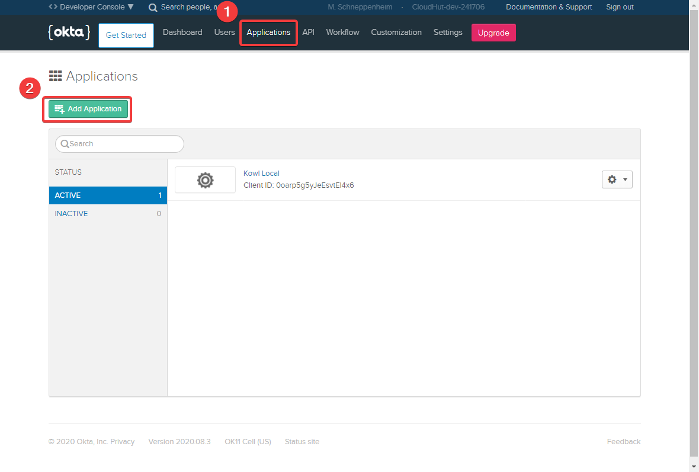
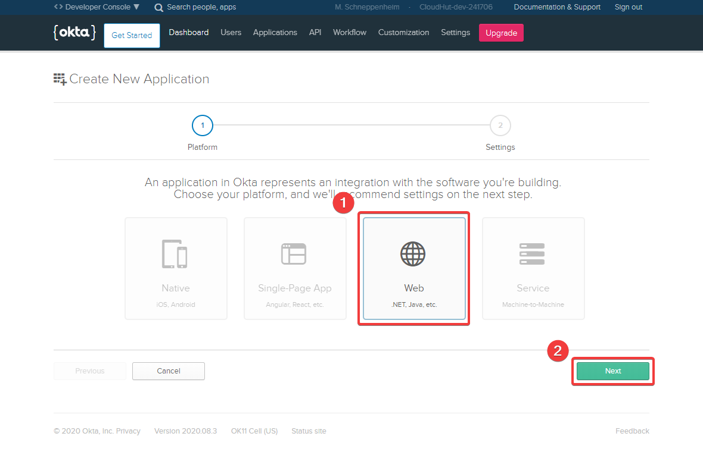
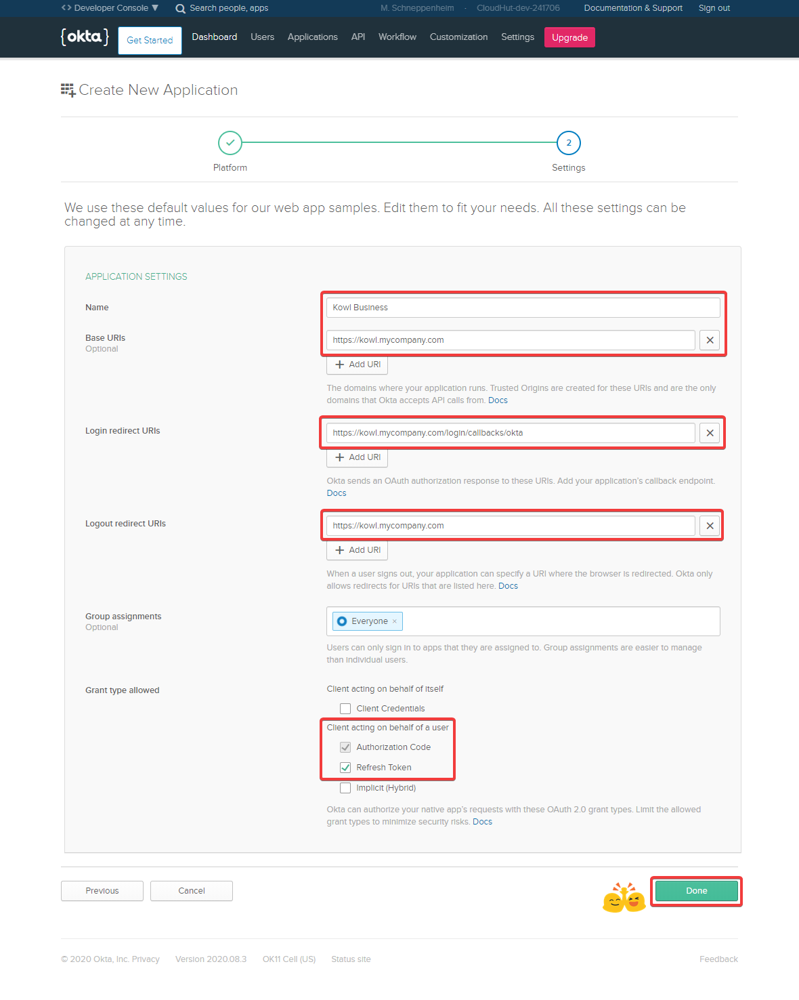
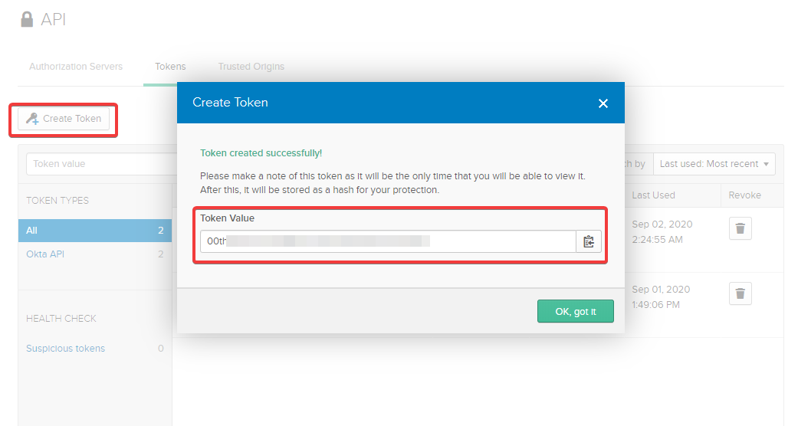

# Okta OIDC Provider Setup

This section guides you through the required steps to setup an OIDC application at Okta.
At the end of this guide you'll have an OAuth client id and client secret. If you are going
to setup the Okta Groups Sync (step 4) you'll additionally end up with an API token.

This guide assumes you already have an Okta account and permissions to create Applications
within your organization.

## 1. Create OpenID Connect Application

First log into your Okta account at https://login.okta.com/ and open your Okta dashboard.
Navigate to Applications on the top menu bar. On the applications page click the "Add Application"
button. This will guide you through a setup wizard to create a new OpenID connect application.

## 2. Application Setup Wizard

On the first step in the wizard choose "Web (.Net, Java, etc.)" as Platform and click the Next button.

The next step in the wizard asks you to provide some information about your application. We assume
that you run Kowl at `kowl.mycompany.com`.

- Name: Kowl Business (actually any name you'd like to use)
- Base URIs: https://kowl.mycompany.com (optional)
- Login redirect URIs: https://kowl.mycompany.com/login/callbacks/okta
- Logout redirect URIs: https://kowl.mycompany.com
- Group assignments: Add the user groups that can sign in to this application (optional)
- Grant type allowed: Enable "Authorization Code" and "Refresh Token"

## 3. Get client credentials

After you clicked the Done button from the previous step you'll be redirected to your application's
page. Scroll down and you'll find the "Client Credentials" box which lets you copy the Client ID and
Client secret.

## 4. Okta Groups Sync (optional)

If desired you can bind permissions (Roles) to Okta Groups defined in your organization 
(see [Role Bindings](../authorization/role-bindings.md)). Therefore you must grant Kowl 
permissions to resolve the memberships of all bound Okta Groups.

To do so hover "Api" in the top menu bar and select "Tokens". Click the Create Token button
and a modal will pop up. Enter the name for your token and proceed. The modal will show
you the created token which you then can use in your Kowl Business config.

