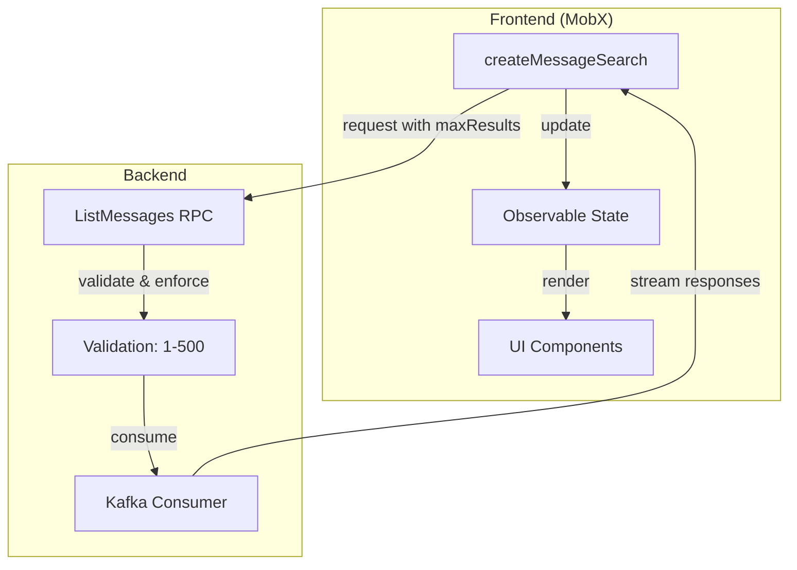
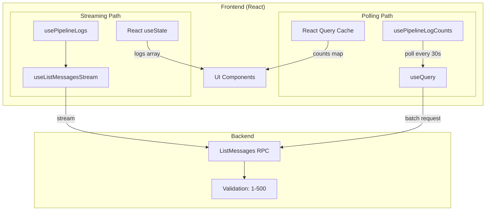

# Pipeline Logs Architecture Audit and Simplification Plan

## Executive Summary

The modern pipeline logs implementation diverges from the legacy `createMessageSearch` pattern in key ways. Most significantly, **limits are hardcoded in the frontend** rather than being backend-driven. This audit identifies the divergences and proposes a simplified architecture.

---

## Architecture Comparison

### Legacy Pattern: `createMessageSearch` ([backend-api.ts](frontend/src/state/backend-api.ts))



**Key characteristics:**

- Single function handles streaming
- MobX observable state for reactivity
- Backend validates and enforces `maxResults` (1-500)
- Frontend passes `maxResults` as a request parameter
- Default: 50 messages (from `topic-settings-store.ts`)
- Legacy LogsTab used: `maxResults: 1000` (exceeds backend limit!)

### Modern Pattern: Pipeline Logs Hooks



**Key characteristics:**

- **Two separate hooks** with different strategies
- `usePipelineLogs`: Streaming via `useListMessagesStream` for detailed log viewing
- `usePipelineLogCounts`: Polling via React Query for batched count fetching
- React state management (useState + React Query)
- Backend still validates `maxResults` (1-500)

---

## Divergences Identified

### 1. Hardcoded Frontend Limits (MAJOR ISSUE)

| Limit | Value | Location | Should Be Backend-Controlled |

| -------------------- | ----- | ------------------------------------------------------------------------------------------------ | ---------------------------- |

| `LOGS_PER_PIPELINE` | 100 | [use-pipeline-log-counts.ts:29](frontend/src/components/ui/pipeline/use-pipeline-log-counts.ts) | Yes |

| `TIME_WINDOW_HOURS` | 5 | [use-pipeline-log-counts.ts:32](frontend/src/components/ui/pipeline/use-pipeline-log-counts.ts) | Yes |

| `MAX_PAGE_SIZE` | 500 | [react-query.utils.ts:14](frontend/src/react-query/react-query.utils.ts) | Yes |

| Default `maxResults` | 100 | [messages.tsx:156](frontend/src/react-query/api/messages.tsx) | Yes |

| Stale time | 30s | [use-pipeline-log-counts.ts:35](frontend/src/components/ui/pipeline/use-pipeline-log-counts.ts) | Possibly |

| Poll interval | 30s | [use-pipeline-log-counts.ts:297](frontend/src/components/ui/pipeline/use-pipeline-log-counts.ts) | Possibly |

**Backend validation** (from [types.go:49](backend/pkg/api/httptypes/types.go)):

```go
if l.MaxResults <= 0 || l.MaxResults > 500 {
    return errors.New("max results must be between 1 and 500")
}
```

**Problem:** The frontend's `LOGS_PER_PIPELINE * N` calculation could exceed 500 when many pipelines are visible. The frontend caps at 100 per pipeline during aggregation, but this is a workaround, not proper backend coordination.

### 2. Dual Hook Architecture

**Legacy:** Single `createMessageSearch` function for everything

**Modern:** Two hooks with different purposes:

- `usePipelineLogs` - detailed streaming (single pipeline)
- `usePipelineLogCounts` - batched polling (multiple pipelines)

This adds complexity but serves a purpose: efficiently fetching counts for table displays without streaming all log content.

### 3. State Management Split

**Legacy:** MobX observables with imperative updates

**Modern:**

- `usePipelineLogs`: React `useState` (streaming)
- `usePipelineLogCounts`: React Query cache (polling)

This is an improvement for React integration but creates inconsistent patterns.

### 4. Aggregation Location

**Legacy:** Backend calculates per-partition limits and distributes messages

**Modern:**

- Backend still does per-partition distribution
- Frontend does additional per-pipeline limiting (`LOGS_PER_PIPELINE`)
- Frontend does scope categorization (input/output/root)

**The scope categorization is fine** (it's UI-specific logic), but the per-pipeline limiting should be backend-controlled.

---

## Requirements Analysis

### Requirement 1: List pipelines on a cluster with warnings/error counts

**Current implementation:** `usePipelineLogCounts` fetches batched counts

- Works but uses hardcoded limits
- Aggregates by scope (input/output/root) correctly
- Uses server-side JavaScript filter for efficiency

**Gap:** No backend endpoint for direct count aggregation

### Requirement 2: Get all logs for a given pipeline ID

**Current implementation:** `usePipelineLogs` streams logs

- Uses `MAX_PAGE_SIZE = 500` default
- Backend caps at 500 anyway
- Time window hardcoded to 5 hours

**Gap:** "All logs" is limited by both frontend and backend caps

### Requirement 3: Backend should control limits

**Current state:**

- Backend validates `maxResults: 1-500`
- Frontend hardcodes multiple limits that override/supplement backend limits
- No mechanism for backend to communicate recommended limits

---

## Simplification Opportunities

### Option A: Backend-Driven Configuration (Recommended)

Add a configuration endpoint or include metadata in the ListMessages response:

```typescript
// Backend could return in stream metadata
type ListMessagesConfig = {
  maxResultsLimit: number; // 500
  recommendedPageSize: number; // 100
  recommendedTimeWindowHours: number; // 5
  recommendedPollIntervalMs: number; // 30000
};
```

**Pros:** Single source of truth, backend controls all limits

**Cons:** Requires backend changes

### Option B: Consolidate to Single Hook Pattern

Replace `usePipelineLogCounts` with a lightweight version of `usePipelineLogs`:

```typescript
// Single hook that can do both full logs and counts
const { logs, counts } = usePipelineLogs({
  pipelineId: "my-pipeline",
  mode: "counts" | "full", // 'counts' only parses WARN/ERROR
});
```

**Pros:** Simpler API, consistent patterns

**Cons:** May be less efficient for count-only use cases

### Option C: Streaming Counts (Like Legacy)

Instead of polling, stream counts using the same pattern as logs:

```typescript
// Use streaming for counts too
const { counts, isStreaming } = useListMessagesStream({
  topic: REDPANDA_CONNECT_LOGS_TOPIC,
  // ... options
});
// Aggregate counts from stream
```

**Pros:** Consistent with legacy pattern, real-time updates

**Cons:** More resource-intensive for many pipelines

---

## Recommended Path Forward

### Phase 1: Remove Frontend-Hardcoded Limits

1. Remove `LOGS_PER_PIPELINE` constant
2. Let backend's 500 limit be the authority
3. Accept that counts may be approximate if > 500 logs exist

### Phase 2: Add Backend Configuration (Optional)

If precise control is needed:

1. Add a `/config` or `/capabilities` endpoint
2. Include recommended limits in response
3. Frontend reads config on startup

### Phase 3: Simplify Hook Architecture (Optional)

1. Consider merging `usePipelineLogCounts` into `usePipelineLogs`
2. Use `mode` parameter to switch between full/counts
3. Maintain React Query for caching but use streaming internally

---

## Current Code Locations

| Component | File | Lines |

| ------------------------------ | -------------------------------------------------------------------------------------------- | --------- |

| Legacy `createMessageSearch` | [backend-api.ts](frontend/src/state/backend-api.ts) | 2755-3141 |

| Legacy `LogsTab` | [pipelines-details.tsx](frontend/src/components/pages/rp-connect/pipelines-details.tsx) | 280-415 |

| Modern `useListMessagesStream` | [messages.tsx](frontend/src/react-query/api/messages.tsx) | 145-317 |

| `usePipelineLogs` | [use-pipeline-logs.ts](frontend/src/components/ui/pipeline/use-pipeline-logs.ts) | 169-225 |

| `usePipelineLogCounts` | [use-pipeline-log-counts.ts](frontend/src/components/ui/pipeline/use-pipeline-log-counts.ts) | 283-306 |

| Backend validation | [types.go](backend/pkg/api/httptypes/types.go) | 49-51 |

| Backend limit enforcement | [list_messages.go](backend/pkg/console/list_messages.go) | 542-544 |

Here's the synthesized analysis of the staged changes:

---

## Staged Changes Analysis: `use-pipeline-log-counts.ts`

### Summary

The staged changes transform the hook from **N parallel queries (one per pipeline)** to **a single batched query** for all pipelines. This is a significant architectural change with both benefits and trade-offs.

---

### Key Changes

| Aspect                 | Before (Original)                                    | After (Staged)                                                       |
| ---------------------- | ---------------------------------------------------- | -------------------------------------------------------------------- |
| **Query Strategy**     | `useQueries` - N parallel requests                   | `useQuery` - 1 batched request                                       |
| **Per-Pipeline Limit** | `LOGS_PER_PIPELINE = 50`                             | Removed - relies on `MAX_PAGE_SIZE = 500`                            |
| **Time Window**        | `TIME_WINDOW_HOURS = 5` (local)                      | Uses `REDPANDA_CONNECT_LOGS_TIME_WINDOW_HOURS` (centralized)         |
| **Server-Side Filter** | Pipeline ID only                                     | Pipeline ID + WARN/ERROR level filtering                             |
| **Cache Key**          | `['pipeline-log-counts', pipelineId]` (per-pipeline) | `['pipeline-log-counts-batch', sortedIds.join(',')]` (all pipelines) |
| **Stale Time**         | 60 seconds                                           | 30 seconds                                                           |
| **Polling**            | None                                                 | 30-second `refetchInterval`                                          |
| **Sorting**            | Client-side timestamp sort                           | None (removed)                                                       |

---

### What's Good About These Changes

1. **Reduced Backend Load**: N requests → 1 request significantly reduces API calls
2. **Server-Side Level Filtering**: Only fetches WARN/ERROR logs, reducing data transfer
3. **Centralized Constants**: Uses shared `REDPANDA_CONNECT_LOGS_TIME_WINDOW_HOURS` and `MAX_PAGE_SIZE`
4. **Automatic Polling**: 30-second `refetchInterval` keeps counts fresh
5. **Stable Query Key**: Sorted IDs ensure cache hits regardless of array order
6. **Cleaner Code**: Removed complex timestamp sorting logic

---

### Concerns / Trade-offs

#### 1. **Per-Pipeline Limit Removal**

**Before**: Each pipeline got up to 50 logs, ensuring fair distribution
**After**: All pipelines share a single `MAX_PAGE_SIZE = 500` limit

**Risk**: If one pipeline has 400 logs and another has 100, the 500 limit may not capture all pipelines equally. High-volume pipelines could dominate the results.

**Verdict**: This aligns with the goal of "letting backend control limits," but may cause uneven count accuracy across pipelines.

#### 2. **Cache Invalidation Behavior**

**Before**: Per-pipeline caching - adding a new pipeline to the view only fetches that pipeline's data
**After**: Batch caching - adding a new pipeline changes the query key, invalidating the entire cache

**Risk**: Pagination/scrolling through a large pipeline list will cause more cache misses and refetches.

**Verdict**: Trade-off between fewer requests (batched) vs better cache hit rate (per-pipeline). For typical use cases with stable pipeline lists, batching wins.

#### 3. **No Aggregation Limit**

```typescript
// Before: Had per-pipeline limit during aggregation
if (currentCount >= LOGS_PER_PIPELINE) {
  continue;
}

// After: Removed - counts everything returned by backend
for (const issue of issues) {
  // No limit check
}
```

**Risk**: If many logs exist for one pipeline, its counts could be disproportionately high compared to pipelines with fewer logs.

**Verdict**: This is intentional - letting backend's `maxResults` be the sole authority. But it changes the semantics from "count of last 50 logs per pipeline" to "count of all logs up to 500 total across all pipelines."

#### 4. **Timestamp Sorting Removed**

**Before**: Sorted messages by timestamp descending to ensure "most recent" logs
**After**: No sorting - relies on backend ordering

**Risk**: If backend doesn't return logs in timestamp order, counts may not reflect "most recent" logs.

**Verdict**: Likely fine if backend returns logs ordered by offset/timestamp, but should verify backend behavior.

---

### Recommendations

1. **Consider a hybrid approach**: Keep per-pipeline limit during aggregation OR use `maxResults = pipelineIds.length * LIMIT` to ensure fair distribution

2. **Verify backend ordering**: Confirm that `ListMessages` returns logs in a consistent order (timestamp descending preferred)

3. **Add dataUpdatedAt to return**: ✅ Already done - useful for UI staleness indicators

4. **Consider cache key optimization**: For large pipeline lists, the query key becomes very long. Could use a hash instead.

---

### Alignment with Architecture Audit

| Audit Finding                       | Staged Changes Address It?                              |
| ----------------------------------- | ------------------------------------------------------- |
| Remove `LOGS_PER_PIPELINE` hardcode | ✅ Yes - removed                                        |
| Remove `TIME_WINDOW_HOURS` hardcode | ✅ Yes - uses centralized constant                      |
| Let backend control limits          | ✅ Yes - uses `MAX_PAGE_SIZE` (backend validates 1-500) |
| Simplify hook architecture          | ⚠️ Partial - still separate from `usePipelineLogs`      |

---

### Final Verdict

**The changes are largely aligned with the architecture audit goals**, but introduce a semantic change: from "per-pipeline snapshot counts" to "total counts from shared pool."

**If the requirement is "show approximate error/warning counts for visible pipelines"** → Changes are fine.

**If the requirement is "show accurate counts from last N logs per pipeline"** → Need to add per-pipeline limiting back during aggregation.

---
